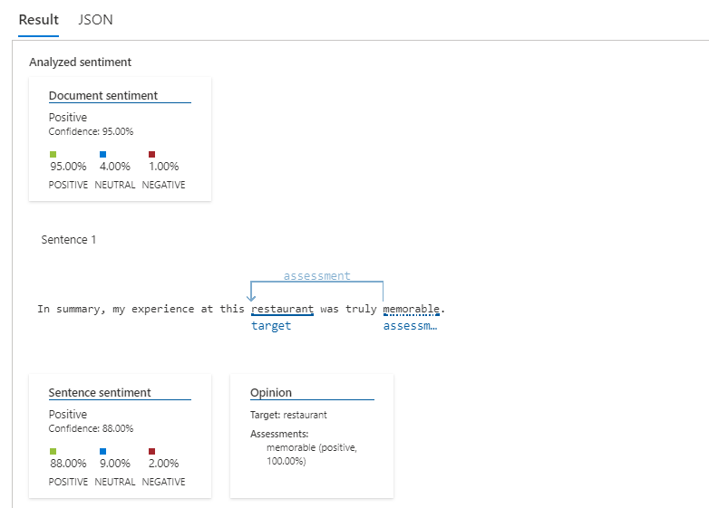
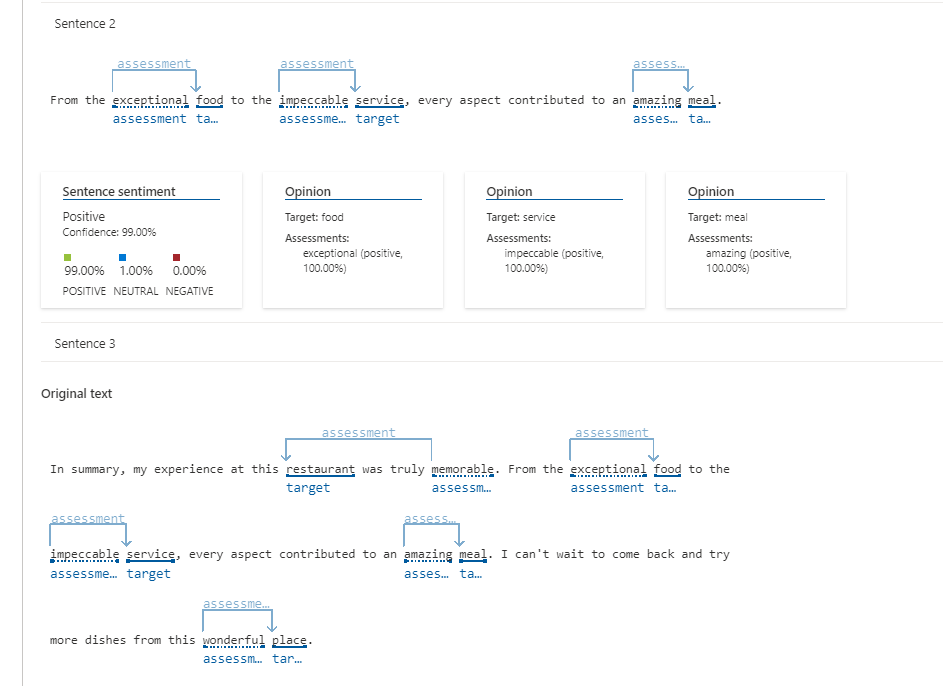

__LAB - Feelings Analysis - Azure IA__
🚀  Objective
The aim of this lab is to utilize Azure AI resources to analyze the "sentiments" of a text.

__Services: Analyze sentiment and mine opinions__
Sentiment analysis and opinion mining are features offered by the Language service, a collection of machine learning and AI algorithms in the cloud for developing intelligent applications involving written language. These resources help you discover what people think about your brand or topic by mining text for clues about positive or negative sentiments and can associate them with specific aspects of the text.

Source: https://learn.microsoft.com/en-us/azure/ai-services/language-service/sentiment-opinion-mining/overview?tabs=prebuilt

__Azure / Language Studio__
To perform the tests in this repository, it is necessary to have an account on Microsoft Azure and access the Language Studio.

https://language.cognitive.azure.com/

https://microsoftlearning.github.io/mslearn-ai-fundamentals/Instructions/Labs/06-text-analysis.html

Source data for analysis:
A detailed analysis will be performed on a text aiming to identify its "emotions".

Here's the text to be analyzed:

In summary, my experience at this restaurant was truly memorable. From the exceptional food to the impeccable service, every aspect contributed to an amazing meal. I can't wait to come back and try more dishes from this wonderful place.

__Result:__

